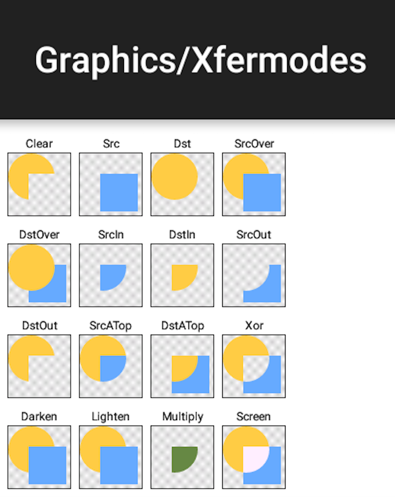

# Xfermode #
- Xfer 转送,转移,传递 mode模式
- Xfermode 转换模式，传递模式，混合模式，描述起来感觉很抽象，还是引用官方的一张图来看看到底是个什么吧!

- 有的人一看这张图，不仅又说了一句，这是什么鬼？还记得我们Shader中的ComposeShader嘛？
  - 组合Shader，有三个参数，前两个参数是两个Shader，最后一个就是Xfermode
    - 第一个Shader咱们说它是dst　　　　黄圆Src
    - 第二个Shader咱们说它是src　　　　蓝方块Dst
    - 第三个参数就是咱们今天要说的这个Xfermode，有的人立马说了不是还有PorterDuff.Mode嘛？实际上两种在内部都是调用的PorterDuff.Mode，都一样，都一样哈
- 我的理解就是两张图绘制完了合并的时候到底留下哪部分，每种模式对应不同的合并方案
